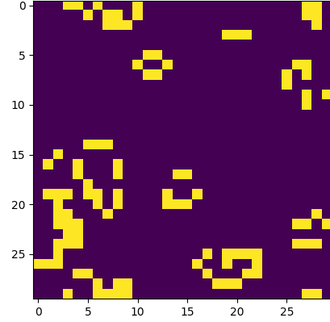

# Game-of-Life  
## Description
------
Coding [Conway's Game of Life](https://en.wikipedia.org/wiki/Conway%27s_Game_of_Life), to illustrate cellular automation.

### required Libraries
* Random, time, os, matplotlib
* Executed in Ubuntu 18.04
* Run: #python3 main.py 
#### Output Sample:

------
Licenced under [MIT Licence](LICENSE).
